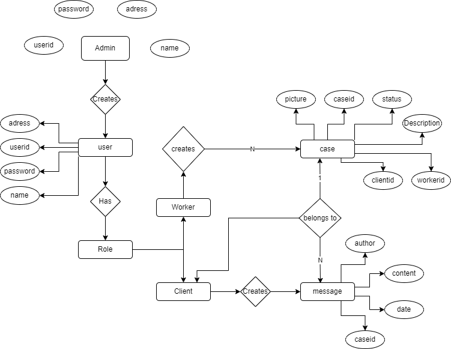

# slutprojekt-backend
Inge Bra Bygg AB
## Project setup
```
npm install
```
# Diagram v1.0


### EndPoints

| End Point | Method | Details | Request Body | Query
| ------ | ------ | ------ | ------ | ------ |
| /api/auth/ | POST | Authenticates user with email & password. Returns a JWT-token which can be used during every API call in Authorization-header. | {"email": "...", "password" : "..."} | ❌ |
| /api/registerclient/ | POST | Registers a client.Only for admin | {email:"...", password:"...", role:"client	", userName:"..."} |  ❌ |
| /api/registerworker/ | POST | Registers a worker. Only fo r admin |{email:"...", password:"...", role:"worker", userName:"..."}  |  ❌ |
| /api/users/ | GET | Get all the users. Only for admin | ❌ |  ❌ |
| /api/tasks/ | GET | Get all the tasks. An admin gets all the tasks of all users. A worker or a client gets only tasks linked to them | ❌ |  ❌ |
| /api/tasks/create | POST | Creates a task. Only for workers | { description:"...", clientId:"..", title: "..."} |  ❌ |
| /api/tasks/:id | PATCH | Update a task. Only for workers. Can update the status as well | { description:"...", title: "...", status:"..."}|  ❌ |
| /api/delete/:id | DELETE | Delete a task. Only for admins. Deletes a particular task | { description:"...", title: "...", status:"..."}|  ❌ |

